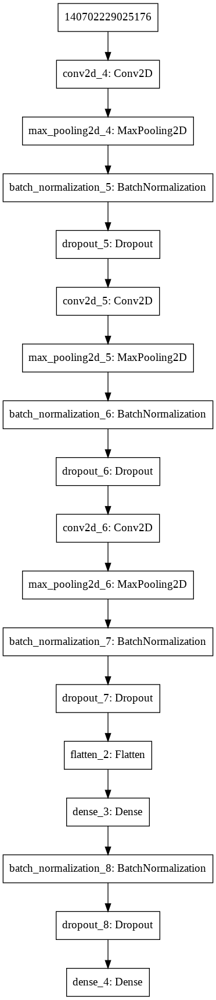

# Malaria-Cell-Classification
Implementing a LeNet style CNN, with increasing number of filters and decreasing dimensions, to classify a given cell image as either parasitized with malaria or uninfected. The dimensions get halved and number of filters get doubled after every block of Conv2D, MaxPooling2D, BatchNormalizaation and Dropout layers. The dimensions decrease from 62x62 to 6x6 and the number of filters increase from 32 to 128, followed by a flattening and then an FC layer. The model plot is as follows:

  

Other details:
- Optimizer: Adam
- Loss: categorical crossentroy
- Dropout: 0.2 in all the layers
